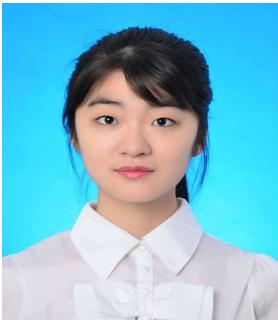

General deep understanding in cutting-edge technology Multiple experience in AI start-up Highly-motivated in being exposed to diverse culture Deep understanding in modern art, literature and movies

# Working Experience

# HU YIFAN

# Personal details

Sex ：female  
Birth of date：1999/3/16  
Age ：25  
Major ：computer science  
Minor : Mathematics

# Contact

telephone：18918936863email: 595674464@qq.com

# Personal advantage

Major in computer science,   
minor in Math   
Deep understanding in cuttingedge technology   
Passionate and interested in   
multidisciplinary science and mathematics.   
Deep immersion user of several social media platforms   
Experience in editing wechat account   
Strong oral presentation and writing skills in English   
Capable of direct communicatio in English.   
Basic proficiency in German.

2025.1— 2025.6 Cofounder & CTO

2024.10—now Full time: Full-stack developer

2020.6—2020.8   
Internship:   
Big data   
engineer

Led an AIGC application project at the intersection of spatial intelligence and 3D generation. Conducted in-depth research on generative model pathways for reconstructing interactive 3D scenes from multimodal data. Defined the technical roadmap, selected and fine-tuned model architectures, and oversaw integration into scalable product pipelines for immersive spatial applications.

# VV4G Technologies Ltd.

2019.12—2020.1 Internship: Deep learning engineer

AI-driven Otome Game start-up   
1 full-stack development：   
Use tRPC framework to develop(Next.js, TRPC, T3, Typescript, drizzle, Tailwind,   
Zod) use cursor to develop a chatbot system / sentiment analysis   
2 get used to the fast pace environment in startup

# Yovole Network SHANGHAI

cloud computing, internet data center (IDC) 1, cloud platform monitoring: configurated and maintained ELK framework and collected the user log to analyze data 2, maintain microservices platform: learned and used spring cloud

# Wavelet. SUZHOU

start-up Collected EEG, EMG to develop product based on the designed chip and algorithm 1，dynamic hand gestures translating algorithm design： designed algorithm(like transformer)from the beginning of project. 2, Gained experience in AI start-ups with a dynamic atmosphere.

# Education background

# 2020.8 – 2024.6 Bachelor of science University of Sydney

Major: Computer science Minor: Math

# 8 Skills

Language: mandarin, English, German   
Coding Language: Python R java C   
technology stack: fullstack in Trpc   
Knowledge: Comprehensive understanding of multifaceted science, technology, modern art, literature movies and business.   
Advantages: Motivated to apply novel strategies like AI in manufacturing plants.   
Experience: promotion experience in trading business   
Certificates: Goethe language course proof in German B1.1

# Project experience

2020.12-2021.2 dynamic hand gesture translating using EMG 2022.3 -2022.6 build database and trading system in c Multi process project in c